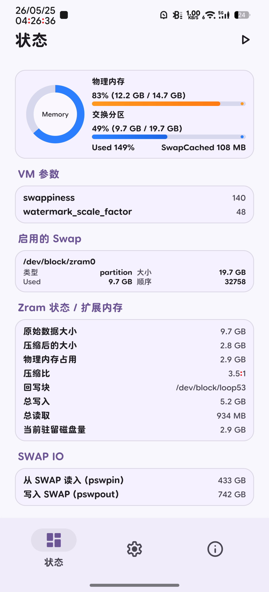
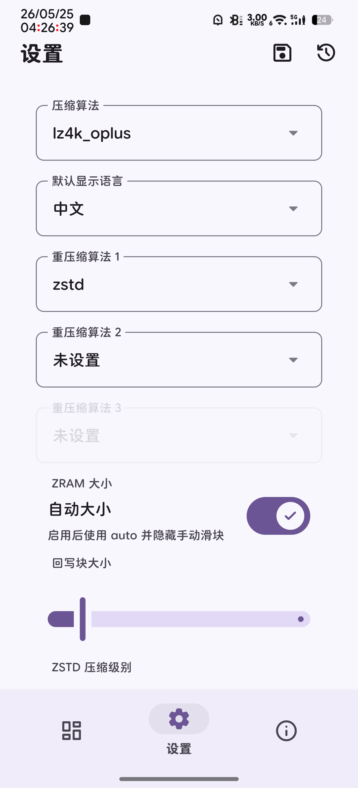

# Zram_WebUI

<p align="center">
    
    
    
    
    
    
</p>

<p align="center">
    <strong>Zram_WebUI</strong> 是一个面向 Android Root 环境的 ZRAM 管理模块，<br/>
    提供可视化 WebUI 来查看内存 / Swap / Zram 状态，并直接调整压缩算法、ZRAM 大小、ZSTD 压缩级别等核心参数。<br/>
    兼容 Magisk / KernelSU / APatch，将 ZRAM 的运行状态、配置项和日志能力整合到同一个界面中。
</p>

## ⚡ 功能特性

| 特性 | 详细说明 |
| :--- | :--- |
| 📊 **状态总览** | 实时展示物理内存、Swap 占用、Zram 压缩比与 I/O 指标，以及常见 VM 参数。 |
| ⚙️ **压缩算法管理** | 支持主压缩算法切换、最多 3 级重压缩算法配置、ZSTD 压缩级别调整。 |
| 📐 **ZRAM 大小控制** | 支持自动大小 / 手动指定 ZRAM 大小，适配不同内核特性。 |
| 💾 **Writeback 支持** | 支持 writeback 文件创建、loop 绑定、backing device 设置与回写块大小配置。 |
| 🌐 **多语言 WebUI** | 三端页面（状态、设置、关于），支持中文、英文、俄文，适配移动端交互。 |
| 📦 **日志导出** | 内置日志系统，支持导出日志压缩包，便于排查兼容性和性能问题。 |
| 🔧 **原生组件** | 包含 `filewatcher` 文件监控、`f2fs_pin` 写回 pinning 及定制 `util-linux` 工具链。 |
| 🔄 **动态降级** | 根据内核支持情况动态判断功能可用性，不支持的特性自动降级处理。 |

## 📸 界面截图

| 状态页 | 设置页 |
| :---: | :---: |
|  |  |

## 📥 安装方式

### 直接使用

下载最新构建的模块 ZIP，通过以下任一 Root 管理器安装：

- **Magisk** ⚠️
- **KernelSU**
- **APatch**

> **⚠️ Magisk 用户注意：** Magisk 本身不提供 WebUI 支持，需要额外安装 [KsuWebUIStandalone](https://github.com/5ec1cff/KsuWebUIStandalone) 才能打开模块的 WebUI 界面。

安装完成后重启设备，在支持 WebUI 的管理器环境中打开模块页面即可。

### 从源码构建

**环境要求：**

- JDK 21
- Android NDK（需设置 `ANDROID_NDK_HOME` 环境变量）
- Linux 构建环境

**构建命令：**

```bash
./gradlew module:zipRelease
```

构建过程会自动编译 C / C++ 原生组件并打包进模块产物。

## 🪪 开源许可

项目根目录采用 **MIT License**，仓库内部分第三方源码和组件遵循其各自许可证，使用时请一并留意对应目录中的授权说明。

## 🙏 致谢

- [md3css](https://github.com/jogemu/md3css) 提供的 Material 3 风格样式思路
- [AMMF2](https://github.com/Aurora-Nasa-1/AMMF2) 本模块的模板
- Android Root 社区中围绕 ZRAM、Swap、writeback 的实践经验
- 所有参与测试与反馈的用户

## ⭐ Star History

<a href="https://star-history.com/#brokestar233/Zram_WebUI&Timeline">
    <picture>
        <source media="(prefers-color-scheme: dark)" srcset="https://api.star-history.com/svg?repos=brokestar233/Zram_WebUI&type=Timeline&theme=dark"/>
        <source media="(prefers-color-scheme: light)" srcset="https://api.star-history.com/svg?repos=brokestar233/Zram_WebUI&type=Timeline"/>
        
    </picture>
</a>
